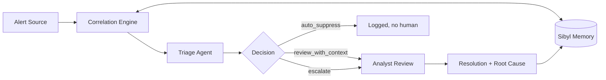

# Continuum — architecture

## Flow



## Sibyl Memory tier mapping (5-tier schema, SDK 0.6.1)

| Tier    | API                          | Continuum use                                            |
|---------|------------------------------|----------------------------------------------------------|
| WARM    | `set_entity/get_entity`      | incidents (`category="incident"`), entity profiles (`user`/`host`/`ip`/...), technique stats (`category="technique"`) |
| COLD    | `write_event/read_events`    | append-only audit journal: every triage + every resolution |
| HOT     | `set_state/get_state`        | org context (industry, analyst count)                    |
| REFERENCE | `set_reference/get_reference` | playbooks / static notes                                |
| ARCHIVE | `archive_entity`             | retired entities, recoverable, out of the active set     |

Uniqueness of `(tenant_id, category, name)` is enforced by the SDK's
schema, so an incident id can never be duplicated by accident.

## Where memory is load-bearing (for the gate)

1. `src/continuum/memory/sibyl_client.py` — the only file that touches
   the SDK. Everything else goes through `ContinuumMemory`.
2. `src/continuum/correlation/engine.py` — `correlate()` turns a raw
   alert into a `MemoryContext` via FTS5 entity recall +
   technique stats + recent journal.
3. `src/continuum/agent/triage_agent.py` — `RuleTriageAgent` decides
   *from* the retrieved context and cites real incident ids; the LLM
   backend is fail-closed on citations.
4. `src/continuum/feedback/resolve.py` — resolutions write back into
   incident entities, entity profiles, technique stats and the journal.

Deletion test (the gate, on camera):

```bash
continuum triage demo/alerts_session2.json --db demo/demo_memory.db   # auto_suppress
continuum triage demo/alerts_session2.json --no-memory                # escalate, blind
```

## Decisions

- **CLI-first, no dashboard.** The fresh-session recall moment scores;
  UI polish does not.
- **Rule agent is the default, LLM is pluggable.** Tests and the demo
  must be deterministic and key-free; the LLM path (`LLMTriageAgent`)
  is one flag away (`--llm`, `LLM_API_KEY` env).
- **Citations are fail-closed.** The LLM may only cite incident ids that
  were actually retrieved from memory; hallucinated ids are dropped.
- **No partner stacks claimed.** Base/Virtuals integrations were
  considered; this build has no partner-stack integration, so the
  multiplier is honestly declared as x1.00.
